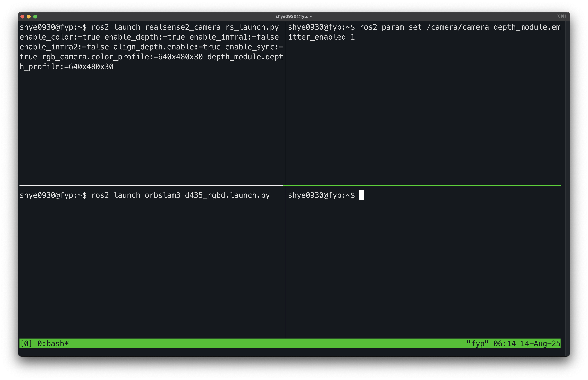
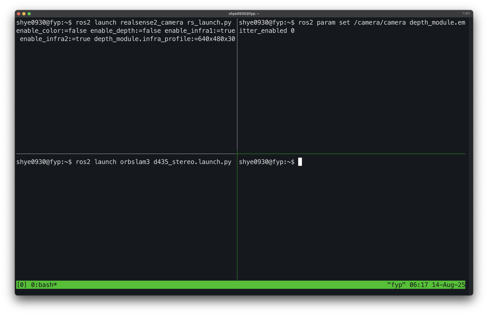
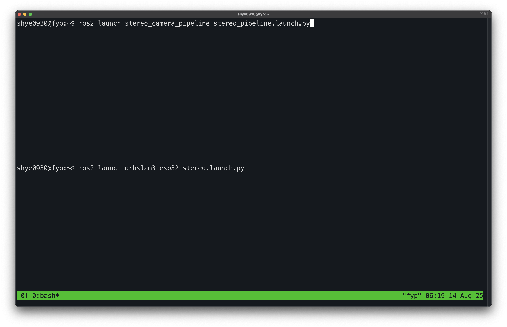
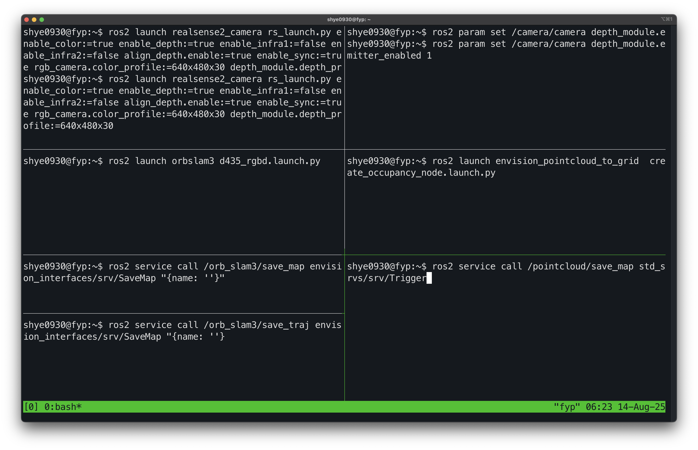
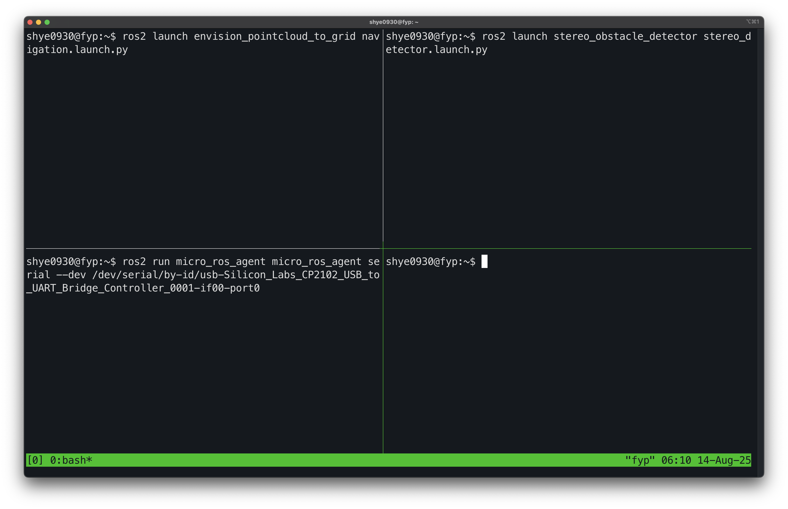

# <h1 style="color:#1F1F1F; background-color:#EDEDED; text-align:center; text-style:bold; font-family:'Chalkboard' ;">Envision </h1>


| Proj # 	| CCDS24-0982 	|
|---	|---	|
| Acad Yr/ Sem 	| 2024/2 	|
| Proj Title 	| Smart Navigation Device for the Visually Impaired 	|
| Proj Summary 	| This project aims to build wearable devices that can guide people with visual impairment in indoor navigation such as home, retail establishments. The core technology for achieving this is visual localization and mapping. When the user enters the environment, a map will be downloaded to the device. The wearable devices will run visual localization that tracks the movement of the user over time. In addition, the wearable device will a provide audio/tactile feedback to the user to ensure safe and comfortable navigation. 	|

# Project Setup and Execution Guide

## Pre-requisites installation guide
1. The comprehensive guide for installing all necessary pre-requisites is available [here](./assets/Installation_guide.md)

2. KITTI Dataset (Use for testing)
    
- Download the dataset (grayscale images) from [here](http://www.cvlibs.net/datasets/kitti/eval_odometry.php)

- Execute the following command. Change KITTIX.yaml by KITTI00-02.yaml, KITTI03.yaml or KITTI04-12.yaml for sequence 0 to 2, 3, and 4 to 12 respectively. Change PATH_TO_DATASET_FOLDER to the uncompressed dataset folder. Change SEQUENCE_NUMBER to 00, 01, 02,.., 11.


## Building the Project
**[Warning]** Ensure at least 13 GB of RAM is available for the build process; otherwise, activate swap space to avoid issues.

Navigate to the `FYP` folder and execute the following commands to build the project:

```sh
chmod +x scripts/build_everything.sh scripts/rebuild_essential.sh
./scripts/build_everything.sh
```

After the initial build with `build_everything.sh`, if changes are made to `ORB_SLAM3_COMMUNITY` or `ros_ws/orbslam3`, update the build by running:

```sh
./scripts/rebuild_essential.sh
```

## Calibration of IP camera
Calibration of cameras in stereo vision is crucial to accurately determine the relative position and orientation between the two cameras. It ensures that corresponding points in the image pairs can be correctly matched, which is essential for precise depth estimation. Without calibration, 3D reconstruction and distance measurements would be unreliable and distorted.

Refer to the calibration tutorial located at:
```md
├── camera
│   ├── arduino
│   └── **camera_calibration**
```

**Tutorial to calibrate [here](./camera/camera_calibration/README.md)**


## Mapping
- [ ] **Come out with the steps to perform mapping**
- [ ] **See if I need to think about merging the old pgm maps and stuff to create a bigger occu map**

#### **For Intel RealSense D435 (RGB-D Mode)**

```sh
# For Intel RealSense D435, run for RGB-D
ros2 launch realsense2_camera rs_launch.py enable_color:=true enable_depth:=true enable_infra1:=false enable_infra2:=false align_depth.enable:=true enable_sync:=true rgb_camera.color_profile:=640x480x30 depth_module.depth_profile:=640x480x30

# Enable IR emitter
ros2 param set /camera/camera depth_module.emitter_enabled 1

ros2 launch orbslam3 d435_rgbd.launch.py
```



#### **For Intel RealSense D435 (Stereo Mode)**

```sh
ros2 launch realsense2_camera rs_launch.py enable_color:=false enable_depth:=false enable_infra1:=true enable_infra2:=true depth_module.infra_profile:=640x480x30 

# Disable IR emitter
ros2 param set /camera/camera depth_module.emitter_enabled 0


ros2 launch orbslam3 d435_stereo.launch.py
```


#### **For ESP32 (Stereo Mode)**

```sh
# Publish the stereo channel from ESP32
ros2 launch stereo_camera_pipeline stereo_pipeline.launch.py

ros2 launch orbslam3 esp32_stereo.launch.py
```



#### **Occupancy map generator**
```sh
ros2 launch envision_pointcloud_to_grid  create_occupancy_node.launch.py
```

#### **Save the map**
```sh
# Save orb slam map as osa
ros2 service call /orb_slam3/save_map envision_interfaces/srv/SaveMap "{name: ''}"

# Save the keyframe and traj
ros2 service call /orb_slam3/save_traj envision_interfaces/srv/SaveMap "{name: ''}"

# The generated map is saved as a PGM file using the following service call:
ros2 service call /pointcloud/save_map std_srvs/srv/Trigger
```

#### Example of the command to launch for mapping




## Navigation 
- [ ] Come out COMMANDS FOR NETWORK MICRO ROS  

```sh
# Terminal 1 
ros2 launch envision_pointcloud_to_grid navigation.launch.py

# Terminal 2
ros2 launch stereo_obstacle_detector stereo_detector.launch.py 
```


### micro ros

```sh
# Serial
ros2 run micro_ros_agent micro_ros_agent serial --dev /dev/serial/by-id/usb-Silicon_Labs_CP2102_USB_to_UART_Bridge_Controller_0001-if00-port0 

# UDP network
ros2 run micro_ros_agent micro_ros_agent udp4 --port 8888 
```




## TODO:
- [ ] Use pyttsx3 for text to speech (navigation)

```python
import pyttsx3
engine = pyttsx3.init()
engine.setProperty("rate", 150)
engine.say("I will speak this text")
engine.runAndWait()
```


## List of ros2 packages used in the project
Below is a comprehensive list of the ROS 2 packages integrated into this project. Each package is linked to its respective section for detailed setup and execution instructions.

- [Stereo Camera Pipeline](./assets/project_components.md#stereo-camera-pipeline): Processes and publishes rectified stereo images for downstream applications.
- [ORB-SLAM3 ROS](./assets/project_components.md#running-orb-slam-3-via-ros2): Implements the ORB-SLAM3 with a ros wrapper to publish point cloud, camera pose and etc.
- [Stereo Obstacle Detector](./assets/project_components.md#running-stereo-obstacle-detector): Detects obstacles using stereo vision data for obstacle avoidance purposes.
- [Image Masker](./assets/project_components.md#image-masker): Applies segmentation-based masking to stereo images using YOLO models.
- [Navigational Speaker](./assets/project_components.md#navigational-speaker): Converts text to speech for navigational audio feedback.
- ~~[Pointcloud to Grid](./assets/project_components.md#pointcloud-to-grid): Converts point cloud data into 2D occupancy grids for mapping and navigation.~~ (Package not in used cause it requires lidar to calculate intensity)
- [Envision Pointcloud to Grid](./assets/project_components.md#envision-pointcloud-to-grid): Converts point cloud data into 2D occupancy grids for mapping, goal mapping and navigation. 

Explore each section for detailed configuration and usage instructions specific to each package.


## <h2 style="color:#1F1F1F; background-color:#B0B0B0; text-align:center; text-style:bold; font-family:'Chalkboard' ;">ROS2 Bag Record Misc Stuff</h2>

### **Record stereo (w/ realsense)**
```sh
ros2 bag record -o my_house_stereo /orb_slam3/all_points /orb_slam3/kf_markers /orb_slam3/kf_markers_array /orb_slam3/tracked_points /orb_slam3/tracking_image /orb_slam3_ros/trajectory /camera/camera/infra1/image_rect_raw /camera/camera/infra2/image_rect_raw 
```
### **Record rgbd (w/ realsense)**
```sh
ros2 bag record -o my_house_rgbd /orb_slam3/all_points /orb_slam3/kf_markers /orb_slam3/kf_markers_array /orb_slam3/tracked_points /orb_slam3/tracking_image /orb_slam3_ros/trajectory /camera/camera/color/image_raw /camera/camera/aligned_depth_to_color/image_raw
```

### **Play the rosbag**
```sh
ros2 bag play my_house_rgbdag

```


## <h2 style="color:#1F1F1F; background-color:#B0B0B0; text-align:center; text-style:bold; font-family:'Chalkboard' ;"> Debug info used throughout the repo </h2>

[INFO]: For informational messages, especially when the code is doing something expected but noteworthy (e.g., successful initialization, a specific mode being activated).

[DEBUG]: For messages related to debugging specific issues or temporary print statements you might remove later.

[WARN]: For potential issues that don't stop execution but might lead to problems (e.g., a default value being used because a parameter was missing).

[ERROR]: For critical errors that prevent the code from functioning correctly.

[TODO]: For features or improvements that need to be implemented.

[FIXME]: For known bugs that need fixing.

[HACK]: For a workaround that might not be the cleanest solution but gets the job done for now.

[NOTE]: For important design decisions or caveats.


