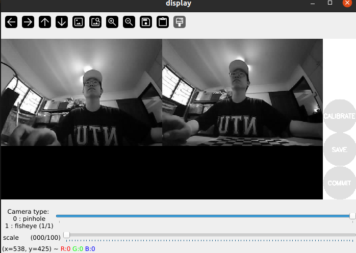

# Camera Calibration 
This markdown will be a guide on calibrating stereo camera with ros2 rolling. We will be following this [link](https://docs.ros.org/en/rolling/p/camera_calibration/doc/tutorial_stereo.html)

## Prerequsites
1. Ros2 rolling installed
2. The default python running within Ubuntu 24.04

## Installing camera_calibration package 
```shell
sudo apt install ros-rolling-camera-calibration
pip3 install simver
```

To verify the installation, run the following command which shows where the package is installed.
```shell
ros2 pkg prefix camera_calibration
```

## Arduino Code for esp32 camera

```cpp
#include "esp_camera.h"
#include <WiFi.h>

//
// WARNING!!! PSRAM IC required for UXGA resolution and high JPEG quality
//            Ensure ESP32 Wrover Module or other board with PSRAM is selected
//            Partial images will be transmitted if image exceeds buffer size
//
//            You must select partition scheme from the board menu that has at least 3MB APP space.
//            Face Recognition is DISABLED for ESP32 and ESP32-S2, because it takes up from 15
//            seconds to process single frame. Face Detection is ENABLED if PSRAM is enabled as well

// ===================
// Select camera model
// ===================
#define CAMERA_MODEL_AI_THINKER // Has PSRAM
#include "camera_pins.h"


// Manual Exposure/Gain/Brightness values - TUNE THESE CAREFULLY!
#define MANUAL_AEC_VALUE 600 // Range 0-1200. Experiment with this heavily!
#define MANUAL_AGC_GAIN 1   // Range 0-30. 0 is lowest gain (least noisy). Experiment.
#define BRIGHTNESS_VALUE 0  // Range -2 to 2. 0 is normal.
#define CONTRAST_VALUE 0    // Range -2 to 2. 0 is normal.
#define SATURATION_VALUE 0  // Range -2 to 2. 0 is normal (will be irrelevant for grayscale, but good to set).


// ===========================
// Enter your WiFi credentials
// ===========================
const char *ssid = "";
const char *password = "";

framesize_t current_cam_framesize;
int current_cam_quality;
gainceiling_t current_cam_gain;

void startCameraServer();
void setupLedFlash(int pin);

void setup() {
  Serial.begin(115200);
  Serial.setDebugOutput(true);
  Serial.println();

  camera_config_t config;
  config.ledc_channel = LEDC_CHANNEL_0;
  config.ledc_timer = LEDC_TIMER_0;
  config.pin_d0 = Y2_GPIO_NUM;
  config.pin_d1 = Y3_GPIO_NUM;
  config.pin_d2 = Y4_GPIO_NUM;
  config.pin_d3 = Y5_GPIO_NUM;
  config.pin_d4 = Y6_GPIO_NUM;
  config.pin_d5 = Y7_GPIO_NUM;
  config.pin_d6 = Y8_GPIO_NUM;
  config.pin_d7 = Y9_GPIO_NUM;
  config.pin_xclk = XCLK_GPIO_NUM;
  config.pin_pclk = PCLK_GPIO_NUM;
  config.pin_vsync = VSYNC_GPIO_NUM;
  config.pin_href = HREF_GPIO_NUM;
  config.pin_sscb_sda = SIOD_GPIO_NUM;
  config.pin_sscb_scl = SIOC_GPIO_NUM;
  config.pin_pwdn = PWDN_GPIO_NUM;
  config.pin_reset = RESET_GPIO_NUM;
  config.xclk_freq_hz = 24000000;//24000000;
  config.pixel_format = PIXFORMAT_JPEG;
  config.fb_count = 2;


  current_cam_framesize = FRAMESIZE_HVGA;
  current_cam_quality = 12; //10-63 lower number means higher quality
  current_cam_gain = (gainceiling_t) 0;

  config.frame_size = current_cam_framesize;
  config.jpeg_quality = current_cam_quality; 
  config.grab_mode = CAMERA_GRAB_LATEST;

  // if PSRAM IC present, init with UXGA resolution and higher JPEG quality
  //                      for larger pre-allocated frame buffer.
  // if (config.pixel_format == PIXFORMAT_JPEG) {
  //   if (psramFound()) {
  //     config.jpeg_quality = 12;
  //     config.fb_count = 2;
  //     config.grab_mode = CAMERA_GRAB_LATEST;
  //   } else {
      
  //     // Limit the frame size when PSRAM is not available
  //     config.frame_size = FRAMESIZE_SVGA;
  //     config.fb_location = CAMERA_FB_IN_DRAM;
  //   }
  // } 

#if defined(CAMERA_MODEL_ESP_EYE)
  pinMode(13, INPUT_PULLUP);
  pinMode(14, INPUT_PULLUP);
#endif

  // camera init
  esp_err_t err = esp_camera_init(&config);
  if (err != ESP_OK) {
    Serial.printf("Camera init failed with error 0x%x", err);
    return;
  }

  
  sensor_t *s = esp_camera_sensor_get();
  // initial sensors are flipped vertically and colors are a bit saturated

  if(s->id.PID == OV2640_PID){
    s->set_vflip(s, 1);        // flip it back
    s->set_hmirror(s,1);
    s->set_dcw(s, 1);           // Digital Crop Window. 

    s->set_whitebal(s, 0);      // 0 = disable, 1 = enable
    s->set_awb_gain(s, 1);      // AWB gain control. Disable this too.
    s->set_wb_mode(s, 0);       // White balance mode (0-4). 0 is Auto, but since set_whitebal is 0, this is less impactful.

    s->set_raw_gma(s,1);        // Allow raw gamma 

    s->set_bpc(s,1);

    // s->set_brightness(s, -2);   // up the brightness just a bit
    // s->set_contrast(s, 0);
    // s->set_saturation(s,2);
    // s->set_gainceiling(s, current_cam_gain);

    // s->set_gain_ctrl(s, 0); 
    // s->set_exposure_ctrl(s, 0); 
    // s->set_agc_gain(s, 1); 
    // s->set_aec_value(s, 600); 

    // 1. Automatic Exposure Control (AEC)
    s->set_exposure_ctrl(s, 0); // 0 = disable, 1 = enable
    s->set_aec2(s, 0);          // AEC Version 2. Disable this too.
    s->set_ae_level(s, 0);      // Exposure level offset. Set to 0 (normal).
    s->set_aec_value(s, MANUAL_AEC_VALUE); // Set manual exposure value when AEC is off.

    s->set_gainceiling(s, current_cam_gain); // Set a low gain ceiling even if AGC is off, to prevent excessive noise if somehow enabled.
    s->set_gain_ctrl(s, 0);     // 0 = disable, 1 = enable
    s->set_agc_gain(s, MANUAL_AGC_GAIN); // Set manual gain value when AGC is off.

    

    // 4. Other image enhancements/auto adjustments
    s->set_brightness(s, BRIGHTNESS_VALUE); // -2 to 2
    s->set_contrast(s, CONTRAST_VALUE);     // -2 to 2
    s->set_saturation(s, SATURATION_VALUE); // -2 to 2 (Irrelevant for grayscale, but good for completeness)
    s->set_sharpness(s, 0);     // -2 to 2. Set to 0 to avoid artificial sharpening that can affect features.
    s->set_special_effect(s, 2); // grayscale

    Serial.printf("xclk freq is %d Mhz \n", s->xclk_freq_hz/1000000);

  }

// Setup LED FLash if LED pin is defined in camera_pins.h
#if defined(LED_GPIO_NUM)
  setupLedFlash(LED_GPIO_NUM);
#endif

  WiFi.begin(ssid, password);
  WiFi.setSleep(false);

  Serial.print("WiFi connecting");
  while (WiFi.status() != WL_CONNECTED) {
    delay(500);
    Serial.print(".");
  }
  Serial.println("");
  Serial.println("WiFi connected");

  if(psramFound()){
    Serial.println("PSRAM available");
  }

  startCameraServer();

  Serial.print("Camera Ready! Use 'http://");
  Serial.print(WiFi.localIP());
  Serial.println("' to connect");
}

void loop() {
  // // Do nothing. Everything is done in another task by the web server
  delay(10000);
}

```

## Calibration
Run this python script

```python
import rclpy
from rclpy.node import Node
from sensor_msgs.msg import Image, CameraInfo
from sensor_msgs.srv import SetCameraInfo # Import the service type
from cv_bridge import CvBridge
import cv2
import threading
import queue
import requests

class CameraStreamThread(threading.Thread):
    def __init__(self, url, name, node):
        super().__init__()
        self.url = url
        self.name = name
        self.node = node
        self.cap = None
        self.latest_frame = None
        self.ret = False
        self.running = True
        self.frame_lock = threading.Lock()
        self.set_flash(128) # Ensure flash is set on initialization

    def set_flash(self, intensity):
        """HTTP control method for LED intensity."""
        intensity = max(0, min(255, intensity))
        try:
            url = f"{self.url}:80/control?var=led_intensity&val={intensity}"
            response = requests.get(url, timeout=2)
            if response.status_code == 200:
                self.intensity = intensity
                self.node.get_logger().info(f"Set {self.name} camera LED intensity to {intensity}.")
            return response.status_code == 200
        except Exception as e:
            self.node.get_logger().error(f"HTTP LED intensity control for {self.name} failed: {e}")
            return False

    def run(self):
        self.node.get_logger().info(f"Connecting to {self.name} camera at {self.url}:81/stream...")
        self.stream_url = self.url + ":81/stream"
        self.cap = cv2.VideoCapture(self.stream_url)

        if not self.cap.isOpened():
            self.node.get_logger().error(f"Failed to open {self.name} stream.")
            self.running = False
            return

        while self.running:
            ret, frame = self.cap.read()
            if ret:
                with self.frame_lock:
                    self.latest_frame = frame
                    self.ret = True
            else:
                self.node.get_logger().warn(f"Failed to read frame from {self.name} camera.")
                self.ret = False
                # Reconnection logic could be added here if the stream consistently breaks
        self.cap.release()
        self.node.get_logger().info(f"{self.name} camera thread stopped.")

    def get_frame(self):
        with self.frame_lock:
            return self.ret, self.latest_frame.copy() if self.latest_frame is not None else None

    def stop(self):
        self.set_flash(0) # Turn off flash when stopping
        self.running = False


class StereoCameraPublisher(Node):

    def __init__(self):
        super().__init__('stereo_camera_publisher')
        self.left_image_pub = self.create_publisher(Image, '/stereo/left/image_raw', 10)
        self.right_image_pub = self.create_publisher(Image, '/stereo/right/image_raw', 10)
        self.left_info_pub = self.create_publisher(CameraInfo, '/stereo/left/camera_info', 10)
        self.right_info_pub = self.create_publisher(CameraInfo, '/stereo/right/camera_info', 10)
        self.bridge = CvBridge()

        self.left_url = 'http://192.168.68.57'
        self.right_url = 'http://192.168.68.58'

        # Store camera info internally
        self.left_camera_info = CameraInfo()
        self.right_camera_info = CameraInfo()

        # Create dedicated threads for each camera
        self.left_cam_thread = CameraStreamThread(self.left_url, "left", self)
        self.right_cam_thread = CameraStreamThread(self.right_url, "right", self)

        self.left_cam_thread.start()
        self.right_cam_thread.start()

        # --- ADD DUMMY SERVICES HERE ---
        # Left camera set_camera_info service
        self.left_set_camera_info_service = self.create_service(
            SetCameraInfo,
            'left_camera/set_camera_info', # Service name
            self.handle_left_set_camera_info # Callback function
        )
        self.get_logger().info('Left camera left_camera/set_camera_info service created.')

        # Right camera set_camera_info service
        self.right_set_camera_info_service = self.create_service(
            SetCameraInfo,
            'right_camera/set_camera_info', # Service name
            self.handle_right_set_camera_info # Callback function
        )
        self.get_logger().info('Right camera right_camera/set_camera_info service created.')
        # --- END DUMMY SERVICES ---

        # Timer to periodically get frames from threads and publish
        self.timer = self.create_timer(0.01, self.publish_stereo_frames)

    def handle_left_set_camera_info(self, request, response):
        """
        Dummy service handler for /stereo/left/set_camera_info.
        It pretends to accept the camera info and logs it.
        """
        self.get_logger().info(f"Received SetCameraInfo request for left camera.")
        # In a real scenario, you would validate and store this camera info.
        # For a dummy service, we just acknowledge it.
        self.left_camera_info = request.camera_info # Store the received info
        response.success = True
        response.status_message = "Left camera info received successfully (dummy)."
        return response

    def handle_right_set_camera_info(self, request, response):
        """
        Dummy service handler for /stereo/right/set_camera_info.
        It pretends to accept the camera info and logs it.
        """
        self.get_logger().info(f"Received SetCameraInfo request for right camera.")
        # In a real scenario, you would validate and store this camera info.
        # For a dummy service, we just acknowledge it.
        self.right_camera_info = request.camera_info # Store the received info
        response.success = True
        response.status_message = "Right camera info received successfully (dummy)."
        return response

    def publish_stereo_frames(self):
        ret_l, frame_l = self.left_cam_thread.get_frame()
        ret_r, frame_r = self.right_cam_thread.get_frame()

        if ret_l and ret_r:
            now = self.get_clock().now().to_msg()

            # Publish images
            msg_l = self.bridge.cv2_to_imgmsg(frame_l, encoding='bgr8')
            msg_r = self.bridge.cv2_to_imgmsg(frame_r, encoding='bgr8')

            msg_l.header.stamp = now
            msg_r.header.stamp = now
            msg_l.header.frame_id = 'left_camera_link' # Use a proper frame_id for TF compatibility
            msg_r.header.frame_id = 'right_camera_link'

            self.left_image_pub.publish(msg_l)
            self.right_image_pub.publish(msg_r)

            # Publish CameraInfo (either a dummy one or the one received via service)
            # If you received info via service, use that. Otherwise, generate a dummy.
            
            # Left CameraInfo
            if self.left_camera_info.width == 0 or self.left_camera_info.height == 0:
                # If no info received yet, create a dummy one based on current frame
                h, w = frame_l.shape[:2]
                self.left_camera_info.header.stamp = now
                self.left_camera_info.header.frame_id = 'left_camera_link'
                self.left_camera_info.width = w
                self.left_camera_info.height = h
                # Fill in other fields (K, D, R, P) with zeros or default values if needed
                # For a true dummy, just width/height is often enough for some tools.
                # K (intrinsics matrix) should be 3x3, D (distortion coeffs) 1x5, R (rectification) 3x3, P (projection) 3x4
                self.left_camera_info.k = [0.0]*9 # All zeros for dummy
                self.left_camera_info.d = [0.0]*5 # All zeros for dummy
                self.left_camera_info.r = [0.0]*9
                self.left_camera_info.p = [0.0]*12
            else:
                # Use the info received from the service
                self.left_camera_info.header.stamp = now
                self.left_camera_info.header.frame_id = 'left_camera_link' # Ensure frame_id is consistent
            self.left_info_pub.publish(self.left_camera_info)


            # Right CameraInfo
            if self.right_camera_info.width == 0 or self.right_camera_info.height == 0:
                h, w = frame_r.shape[:2]
                self.right_camera_info.header.stamp = now
                self.right_camera_info.header.frame_id = 'right_camera_link'
                self.right_camera_info.width = w
                self.right_camera_info.height = h
                self.right_camera_info.k = [0.0]*9
                self.right_camera_info.d = [0.0]*5
                self.right_camera_info.r = [0.0]*9
                self.right_camera_info.p = [0.0]*12
            else:
                self.right_camera_info.header.stamp = now
                self.right_camera_info.header.frame_id = 'right_camera_link'
            self.right_info_pub.publish(self.right_camera_info)

        else:
            # self.get_logger().warn("Failed to read one or both frames from camera threads. Waiting for data...")
            pass # Keep it less verbose if it's just a temporary blip


    def destroy_node(self):
        self.left_cam_thread.stop()
        self.right_cam_thread.stop()
        self.left_cam_thread.join()
        self.right_cam_thread.join()
        self.get_logger().info("Shutting down camera threads.")
        super().destroy_node()

def main(args=None):
    rclpy.init(args=args)
    node = StereoCameraPublisher()
    try:
        rclpy.spin(node)
    except KeyboardInterrupt:
        node.get_logger().info("KeyboardInterrupt detected, shutting down.")
    finally:
        node.destroy_node()
        rclpy.shutdown()

if __name__ == '__main__':
    main()
```

### Change the camera IP
In the 2 statement below, change them to your corresponding ESP32 camera IP

```python
self.left_url = 'http://192.168.68.57'
self.right_url = 'http://192.168.68.56' #USB-C module
```

### Publishing of frames
Can either copy the code above or run ```python3 fyp/camera/camera_calibration/ros2_rolling/publish_stereo_rolling.py``` 

**Note** that both files require you to change the camera IP address


### Verification of the publication 
To verify if the python script has publish the relevant topics, you have to run
```ros2 topic list``` and you will see
```sh
/parameter_events
/rosout
/stereo/left/image_raw 
/stereo/right/image_raw  
```

Addtionally do ```ros2 service list``` and you must see
```sh
left_camera/set_camera_info
right_camera/set_camera_info
```
as in ros2 rolling, the script is more stringent in ensuring that the user have the required service before the program can start running

### View the publish frames
```sh
sudo apt install ros-rolling-rqt-image-view
rqt # To launch the viewer
```

### Running ros2 Camera Calibration Program

I am using a 6x9 checkboard of size:30mm

To determine the size of the checkboard, do note that 
- width: Number of intersection points of squares in the long side of the calibration board. Hence for a 6x9 checkboard, the width is (9-1) = 8
- height: Number of intersection points of squares in the short side of the calibration board. Hence for a 6x9 checkboard, the height is (6-1) = 5

Hence the command is 
```sh
ros2 run camera_calibration cameracalibrator --approximate 0.1 --size 8x5 --square 0.029 right:=/stereo/right/image_raw left:=/stereo/left/image_raw right_camera:=/stereo/right left_camera:=/stereo/left

# Calibration Optimizer Options:
#     --fix-aspect-ratio  for pinhole, enforce focal lengths (fx, fy) are equal
```
Afterwards, ensure that in the display you set to the **correct** (pinhole/fisheye) lens.



### Moving the checkerboard
This is taken directly from this [link](https://docs.ros.org/en/rolling/p/camera_calibration/doc/tutorial_stereo.html)


In order to get a good calibration you will need to move the checkerboard around in the camera frame such that:

* The checkerboard is detected at the left and right edges of the field of view (X calibration).

* The checkerboard is detected at the top and bottom edges of the field of view (Y calibration).

* The checkerboard is detected at various angles to the camera (“Skew”).

* The checkerboard fills the entire field of view (Size calibration).

* checkerboard tilted to the left, right, top and bottom (X,Y, and Size calibration).


### Saving the calibration
After the program has automatically taken enough samples, you should be able to press the calibrate button and save the config. Do not press the `config` button as it is not applicable to the ESP32-Camera

Additionally, the console should have printed some logs and you will need to **__save__** the text below `Stereo pinhole calibration` as it contains the T and R matrix to compute the Stereo.T_c1_c2 for our orb slam3 config later on.


## Reference 
1. [Overview of camera claibration](https://docs.ros.org/en/rolling/p/camera_calibration/doc/index.html)
2. [Tutorial: Stereo Calibration](http://wiki.ros.org/camera_calibration/Tutorials/StereoCalibration)
3. [Nodes: Camera Calibrator](https://docs.ros.org/en/rolling/p/camera_calibration/doc/components.html#camera-calibrator)
4. [Fix ros foxy fisheye calibration](https://github.com/ros-perception/image_pipeline/issues/637)
